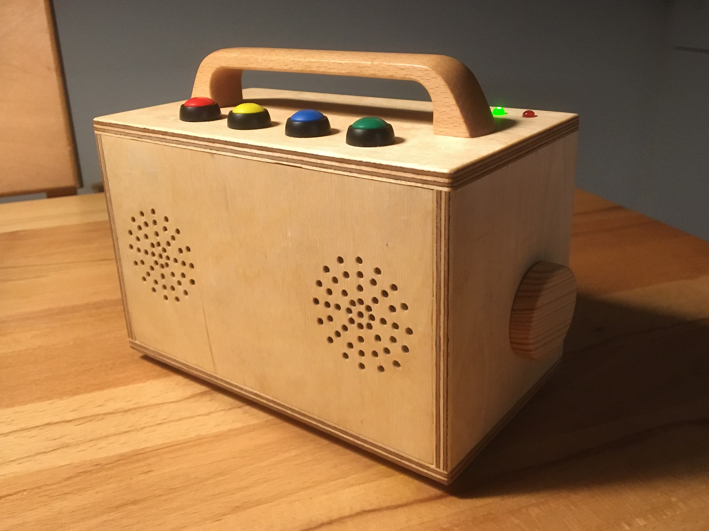

# Kids Music Player v2.0

This is the software for version 2.0 of my contactless music player for kids. I built the [first version](https://github.com/nacht-falter/kids-music-player/tree/legacy) in 2016 and the second version in 2023. For the second version, I rewrote the software in Python and added Spotify support.

The player uses [MPD (Music Player Daemon)](https://www.musicpd.org/) for local music playback and the [Spotify API](https://developer.spotify.com/documentation/web-api/) for streaming music. [gpiozero](https://gpiozero.readthedocs.io/en/stable/) is used for handling button presses.

## Requirements
- Install requirements: `pip install -r requirements.txt`
- Install a spotify client, e.g. [Spotifyd](https://github.com/Spotifyd/spotifyd)
- Install [MPD](https://www.musicpd.org/) and [MPC](https://www.musicpd.org/clients/mpc/)
- Setup environment variables in env.py ([see example config](https://github.com/nacht-falter/kids-music-player/blob/main/example_env.py))

## Version 1.0

The original version of the software only supported local music playback with [MPD](https://www.musicpd.org/). It used a simple shell script for reading RFID cards and handling audio playback. Button presses were sent to the Raspberry Pi via infrared using [lirc](https://lirc.org). The original version written in Bash can be found [here](https://github.com/nacht-falter/kids-music-player/tree/legacy).

